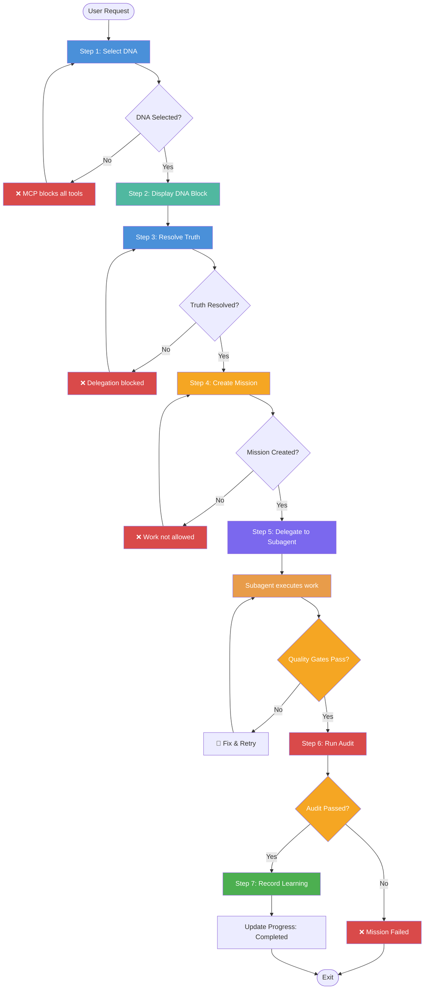
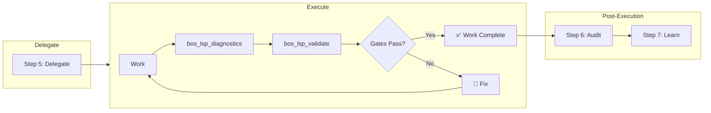

# BehaviorOS Protocol — Delegation & Enforcement Specification

> **Version:** 1.0.0  
> **Status:** Canonical — Source of Truth for all platform integrations  
> **Last Updated:** July 2026  
> **Author:** BehaviorOS Core Team

---

## Table of Contents

1. [Overview](#overview)
2. [The 7 Mandatory Steps](#the-7-mandatory-steps)
3. [Process Flow Diagram](#process-flow-diagram)
4. [Step-by-Step Specification](#step-by-step-specification)
5. [Visual Block Template](#visual-block-template)
6. [Enforcement Rules](#enforcement-rules)
7. [Platform-Specific Sections](#platform-specific-sections)
8. [MCP Tool Reference](#mcp-tool-reference)
9. [Quality Gates](#quality-gates)
10. [Escalation & Conflict Resolution](#escalation--conflict-resolution)
11. [Appendix: Adding Protocol to New Projects](#appendix-adding-protocol-to-new-projects)

---

## Overview

The BehaviorOS Protocol defines the **mandatory delegation and enforcement workflow** that all AI agents MUST follow when operating under BehaviorOS governance. This protocol ensures:

- **Traceability** — Every action is linked to a mission, DNA pattern, and audit trail
- **Deterministic execution** — Steps are sequential and gated by quality checks
- **Zero-defect enforcement** — No action proceeds without passing all gates
- **Audit compliance** — Every delegation is recorded for post-hoc analysis

The protocol is enforced at three levels:

| Level | Enforcer | Mechanism |
|-------|----------|-----------|
| **MCP Server** | `DelegationEnforcementLayer` | Blocks action tools if delegation steps are skipped |
| **OpenCode Plugin** | `tool.execute.before` hook | Intercepts all tools, validates protocol compliance |
| **Runtime** | Agent instructions (AGENTS.md, CLAUDE.md, etc.) | Instructions embedded in agent context |

---

## The 7 Mandatory Steps

Every task, regardless of size or risk level, MUST pass through all 7 steps. The sequence is immutable.

```
┌──────────┐   ┌──────────┐   ┌──────────┐   ┌──────────┐   ┌──────────┐   ┌──────────┐   ┌──────────┐
│  1. DNA  │──▶│ 2. Show │──▶│ 3. Truth│──▶│ 4. Mission│──▶│ 5. Delegate│──▶│ 6. Audit │──▶│ 7. Learn │
│  Select  │   │  Block  │   │ Resolve │   │  Create  │   │          │   │  Run    │   │  Record  │
└──────────┘   └──────────┘   └──────────┘   └──────────┘   └──────────┘   └──────────┘   └──────────┘
```

| # | Step | Tool | When | Enforcement Level |
|---|------|------|------|-------------------|
| 1 | **Select DNA** | `bos_select_dna` | Before ANY task | **CRITICAL** — MCP blocks all action tools if skipped |
| 2 | **Display DNA Block** | Visual template (see §5) | Immediately after step 1 | **HIGH** — Human visibility required |
| 3 | **Resolve Truth** | `bos_resolve_truth` | Before delegating | **CRITICAL** — Delegation blocked if skipped |
| 4 | **Create Mission** | `create-mission` | Before starting work | **HIGH** — No work without mission ID |
| 5 | **Delegate** | Task tool (OpenCode/Cursor/etc.) | To execute work | **CRITICAL** — Direct execution blocked |
| 6 | **Run Audit** | `bos_run_audit` | After completion | **CRITICAL** — Mission cannot be completed |
| 7 | **Record Learning** | `record-learning` | At the end | **MEDIUM** — Warning logged if skipped |

---

## Process Flow Diagram



### Subagent Execution Detail



---

## Step-by-Step Specification

### Step 1: Select DNA

| Field | Value |
|-------|-------|
| **Tool** | `bos_select_dna` |
| **Purpose** | Select the optimal behavioral DNA pattern for the task context |
| **Input** | `{ taskType, domain, riskLevel?, complexity?, agentId? }` |
| **Output** | `{ pattern, blend?, confidence, rationale, principles[], forbidden[] }` |
| **If Skipped** | MCP server blocks ALL action tools via `DelegationEnforcementLayer` |
| **Enforcement** | **CRITICAL** — Hard block at MCP server level |

**Example call:**
```json
{
  "taskType": "feature",
  "domain": "payments",
  "riskLevel": "critical",
  "complexity": "complex"
}
```

**Expected response:**
```json
{
  "pattern": "surgical-team",
  "blend": { "primary": 70, "secondary": 30 },
  "confidence": 0.85,
  "rationale": "Payment changes require zero-defect surgical precision",
  "principles": ["zero-defect", "sterile-field", "timeout-verification"],
  "forbidden": ["skip-validation", "direct-prod-access"]
}
```

**Implementation detail:** The MCP server maintains a `DelegationEnforcementLayer` that tracks which protocol steps have been completed. The layer's `currentState` is checked before any action tool executes. If `step1_completed` is `false`, the layer throws:

```
Delegation enforcement failed: bos_select_dna must be called before any action tool.
Required actions: bos_select_dna
```

---

### Step 2: Display DNA Block

| Field | Value |
|-------|-------|
| **Tool** | Visual output (not an MCP tool) |
| **Purpose** | Display the selected DNA pattern to the human for visibility |
| **Input** | DNA selection result from Step 1 |
| **Output** | Formatted visual block (see §5) |
| **If Skipped** | Human cannot verify which DNA governs the task |
| **Enforcement** | **HIGH** — Agent instructions mandate this; not enforceable at server level |

The orchestrator MUST render the [Visual Block Template](#visual-block-template) verbatim in the conversation immediately after `bos_select_dna` returns. This is a **human-visible governance artifact** that ensures transparency.

---

### Step 3: Resolve Truth

| Field | Value |
|-------|-------|
| **Tool** | `bos_resolve_truth` |
| **Purpose** | Resolve DNA pattern + up-to-date library documentation via Context7 |
| **Input** | `{ taskType, domain, riskLevel?, complexity?, agentId?, libraries? }` |
| **Output** | DNA pattern + instructions to fetch current library docs |
| **If Skipped** | Delegation blocked — subagents may act on stale information |
| **Enforcement** | **CRITICAL** — Hard block on Task tool delegation if not called |

**Example call:**
```json
{
  "taskType": "feature",
  "domain": "backend",
  "agentId": "backend-agent",
  "libraries": ["prisma", "nestjs"]
}
```

**Expected output:**
```json
{
  "pattern": "manufacturing",
  "principles": ["deterministic-pipelines", "zero-defect"],
  "instructions": "Fetch Context7 docs for prisma and nestjs before delegating",
  "context7Queries": [
    { "libraryId": "/prisma/prisma", "query": "migrations and schema updates" },
    { "libraryId": "/nestjs/nestjs", "query": "module structure and providers" }
  ]
}
```

---

### Step 4: Create Mission

| Field | Value |
|-------|-------|
| **Tool** | `create-mission` |
| **Purpose** | Create a traceable mission entity for work tracking |
| **Input** | `{ title, type, priority?, description? }` |
| **Output** | `{ id, title, type, priority, status, createdAt }` |
| **If Skipped** | Work cannot be tracked; audit trail is incomplete |
| **Enforcement** | **HIGH** — Agent instructions mandate this; mission ID required for completion |

**Example call:**
```json
{
  "title": "Implement 3DS validation in payment flow",
  "type": "feature",
  "priority": "critical",
  "description": "Add 3DS2 authentication to the checkout payment flow"
}
```

**Expected output:**
```json
{
  "id": "a1b2c3d4-e5f6-7890-abcd-ef1234567890",
  "title": "Implement 3DS validation in payment flow",
  "type": "feature",
  "priority": "critical",
  "status": "created",
  "createdAt": "2026-07-20T10:30:00.000Z"
}
```

---

### Step 5: Delegate

| Field | Value |
|-------|-------|
| **Tool** | Task tool (platform-specific: OpenCode Task, Cursor Agent, etc.) |
| **Purpose** | Delegate actual work to a specialized subagent |
| **Input** | Task description + DNA principles + Context7 docs |
| **Output** | Completed work output (code, docs, etc.) |
| **If Skipped** | Orchestrator executes work directly — **FORBIDDEN** |
| **Enforcement** | **CRITICAL** — Orchestrator MUST NOT edit files directly |

**Delegation prompt template:**

```markdown
## DNA Pattern
- Pattern: {pattern_name} (confidence: {confidence}%)
- Principles: {principles}
- Forbidden: {forbidden}

## Context7 Documentation
{context7_docs}

## Task
{actual task description}

## Quality Requirements
- Run `bos_lsp_diagnostics` after each edit
- Run `bos_lsp_validate` before completion
- All gates must pass
```

---

### Step 6: Run Audit

| Field | Value |
|-------|-------|
| **Tool** | `bos_run_audit` |
| **Purpose** | Run the continuous audit chain — lint, typecheck, security, coverage, performance |
| **Input** | `{ trigger, context? }` |
| **Output** | `{ gates[], passed, summary }` |
| **If Skipped** | Mission cannot be marked completed |
| **Enforcement** | **CRITICAL** — `update-progress` to `completed` requires audit pass |

**Example call:**
```json
{
  "trigger": "pr",
  "context": { "branch": "feature/3ds-validation", "files": 12, "author": "backend-agent" }
}
```

**Expected output:**
```json
{
  "gates": [
    { "name": "lint", "status": "passed", "duration": 2300 },
    { "name": "typecheck", "status": "passed", "duration": 4500 },
    { "name": "security", "status": "passed", "duration": 12000 },
    { "name": "coverage", "status": "passed", "threshold": 80, "actual": 87 }
  ],
  "passed": true,
  "summary": "All 4 gates passed in 18.8s"
}
```

**Audit stages in order:**

| Stage | Tool/Command | Threshold | Fail Action |
|-------|-------------|-----------|-------------|
| Lint | `pnpm lint` | 0 errors | Block |
| Typecheck | `pnpm typecheck` | 0 errors | Block |
| Security | `bos_lsp_diagnostics` (security scan) | 0 critical | Block |
| Coverage | `pnpm test -- --coverage` | ≥ 80% | Warn |
| Performance | Benchmark suite | ≥ 90 threshold | Warn |

---

### Step 7: Record Learning

| Field | Value |
|-------|-------|
| **Tool** | `record-learning` |
| **Purpose** | Capture insights, patterns, and observations from the completed work |
| **Input** | `{ type, source, data, confidence? }` |
| **Output** | Confirmation |
| **If Skipped** | Learning engine misses pattern; system loses opportunity to improve |
| **Enforcement** | **MEDIUM** — Warning logged to audit trail |

**Example call:**
```json
{
  "type": "insight",
  "source": "post-mortem",
  "data": {
    "content": "3DS validation requires mandatory security review before implementation",
    "impact": "high",
    "relatedPattern": "payment-validation"
  },
  "confidence": 0.9
}
```

**Supported event types:**

| Type | Description | Use Case |
|------|-------------|----------|
| `observation` | Factual record | "Deploy took 45s" |
| `pattern` | Detected behavioral pattern | "Teams skip audit on hotfixes" |
| `insight` | Derived knowledge | "Staged rollouts reduce incidents by 40%" |
| `feedback` | Human feedback | "Review process needs streamlining" |
| `correction` | Bug fix root cause | "Timeout in Prisma query caused 500 error" |

---

## Visual Block Template

This exact template MUST be displayed by the orchestrator immediately after Step 1 (Select DNA) completes. It is a **required human-visible governance artifact**.

```
╔══════════════════════════════════════════════════════════╗
║ 🧬 BEHAVIORAL DNA SELECTED                              ║
╠══════════════════════════════════════════════════════════╣
║ Padrão:    {pattern_name}                                ║
║ Confiança: {X}%                                          ║
║ Racional:  {rationale}                                   ║
║ Domínio:   {domain}                                      ║
║ Risco:     {riskLevel}                                   ║
╠══════════════════════════════════════════════════════════╣
║ 📏 PRINCÍPIOS ATIVOS:                                    ║
║ • {principle_1}                                          ║
║ • {principle_2}                                          ║
╠══════════════════════════════════════════════════════════╣
║ 🚫 REGRAS PROIBIDAS:                                     ║
║ • {forbidden_1}                                          ║
║ • {forbidden_2}                                          ║
╠══════════════════════════════════════════════════════════╣
║ 📚 CONTEXT7 DOCS: {libraries}                            ║
║ 🤖 AGENTE: {agent_id}                                    ║
║ 📋 TASK: {task_summary}                                  ║
╚══════════════════════════════════════════════════════════╝
```

**Fill instructions:**

| Placeholder | Source | Example |
|-------------|--------|---------|
| `{pattern_name}` | `bos_select_dna` → `pattern` | `surgical-team` |
| `{X}` | `bos_select_dna` → `confidence * 100` | `85` |
| `{rationale}` | `bos_select_dna` → `rationale` | Payment changes require zero-defect |
| `{domain}` | Task context input | `payments` |
| `{riskLevel}` | Task context input | `critical` |
| `{principle_n}` | `bos_select_dna` → `principles[]` | `zero-defect` |
| `{forbidden_n}` | `bos_select_dna` → `forbidden[]` | `skip-validation` |
| `{libraries}` | `bos_resolve_truth` context | `prisma, nestjs` |
| `{agent_id}` | Agent performing delegation | `backend-agent` |
| `{task_summary}` | Human request summary | `Implement 3DS validation` |

---

## Enforcement Rules

### Rule Matrix

| Condition | Enforcement | Action | Error Message |
|-----------|-------------|--------|---------------|
| Step 1 skipped | **CRITICAL** | MCP blocks ALL action tools | `Delegation enforcement failed: bos_select_dna must be called before any action tool.` |
| Step 3 skipped | **CRITICAL** | Delegation is blocked | `Delegation enforcement failed: bos_resolve_truth must be called before delegation.` |
| Step 6 skipped | **CRITICAL** | Mission cannot be marked completed | `Cannot update progress to completed: audit must pass first.` |
| Step 7 skipped | **MEDIUM** | Warning logged to audit trail | `Warning: record-learning was not called for mission {id}.` |
| Orchestrator edits files directly | **CRITICAL** | Block via agent permissions | `Permission denied: orchestrator may not edit files.` |
| Quality gate fails | **HIGH** | Block until fixed | `Quality gate {name} failed: {details}.` |
| Governance rule violated | **CRITICAL** | Block or escalate per rule | `Governance violation: {rule}. Action: {block/escalate}.` |

### Enforcement Architecture

```
┌──────────────────────────────────────────────────────────────────┐
│                       MCP Server Layer                            │
│                                                                   │
│  Agent Action Tool Request                                        │
│       │                                                           │
│       ▼                                                           │
│  DelegationEnforcementLayer                                       │
│       │                                                           │
│       ├── Is tool in DELEGATION_WORKFLOW_TOOLS?                   │
│       │     ├── Yes → Allow (these are always permitted)          │
│       │     └── No  → Check protocol state                       │
│       │                                                           │
│       ├── steps: {                                                 │
│       │     step1_dnaSelected: boolean,                            │
│       │     step3_truthResolved: boolean,                          │
│       │     step4_missionCreated: boolean,                         │
│       │     step6_auditPassed: boolean,                            │
│       │     hasActiveMission: boolean                              │
│       │ }                                                         │
│       │                                                           │
│       ├── If !step1_dnaSelected → BLOCK                           │
│       ├── If !step3_truthResolved → BLOCK                         │
│       ├── If !hasActiveMission → BLOCK                            │
│       └── Else → PASS, execute tool                               │
│                                                                   │
│  DELEGATION_WORKFLOW_TOOLS (always allowed):                       │
│  bos_select_dna, bos_resolve_truth, create-mission,               │
│  update-progress, get-status, list-agents, list-missions,         │
│  bos_list_patterns, bos_get_insights, bos_check_escalation,       │
│  bos_resolve_conflict, bos_run_audit, evaluate-governance         │
└──────────────────────────────────────────────────────────────────┘
```

### OpenCode Plugin Enforcement

For OpenCode environments, a BehaviorOS plugin registers a `tool.execute.before` hook to intercept non-delegation tools:

```typescript
ctx.tool.hook(
  'execute.before',
  Effect.fn(function* (event) {
    // Check if the tool being executed is an action tool
    // (not in the delegation workflow allowlist)
    if (!DELEGATION_WORKFLOW_TOOLS.has(event.toolName)) {
      // Verify that delegation protocol was followed
      const state = yield* getDelegationState()
      if (!state.step1Completed) {
        throw new Error(
          'Protocol violation: bos_select_dna must be called before any action tool.'
        )
      }
    }
  })
)
```

---

## Platform-Specific Sections

Each platform has a designated location where the BehaviorOS Protocol is referenced. All of these files are auto-generated by the CLI command `npx @behavioros/cli init --with-protocol`.

### OpenCode

**File:** `.opencode/rules/behavioros-protocol.mdc` (referenced via `@rules/behavioros-protocol` in `AGENTS.md`)

Add to `AGENTS.md`:

```markdown
## BehaviorOS Protocol

Read the following file immediately — it is mandatory governance for all tasks:

@rules/behavioros-protocol
```

Then create `.opencode/rules/behavioros-protocol.mdc`:

> **Content:** A redirect/embed of `docs/PROTOCOL.md`. This file is auto-generated by the CLI and contains:
> - A reference to the canonical `docs/PROTOCOL.md`
> - The 7 mandatory steps table
> - The visual block template
> - Local enforcement details

**Plugin enforcement** (optional, recommended for enterprise):

Configure in `opencode.json`:

```json
{
  "plugins": {
    "behavioros-protocol": {
      "type": "local",
      "path": ".opencode/plugins/behavioros-protocol.js"
    }
  }
}
```

The plugin registers `tool.execute.before` hooks to enforce protocol steps at the runtime level.

### Cursor

**File:** `.cursor/rules/behavioros-protocol.mdc`

```markdown
---
description: BehaviorOS Protocol — Delegation & Enforcement Specification
globs: ["**/*"]
---

Refer to the canonical protocol document at `docs/PROTOCOL.md`.

## 7 Mandatory Steps

1. **Select DNA** — Call `bos_select_dna` before ANY task
2. **Display DNA Block** — Show the visual block template
3. **Resolve Truth** — Call `bos_resolve_truth` before delegating
4. **Create Mission** — Call `create-mission` before starting work
5. **Delegate** — Use Task tool, never edit directly
6. **Run Audit** — Call `bos_run_audit` after completion
7. **Record Learning** — Call `record-learning` at the end

## Enforcement

- These steps are mandatory. Do not skip any step.
- The MCP server will block actions that violate the protocol.
- Direct file editing by the orchestrator is FORBIDDEN.
- Always delegate to specialized subagents.
```

### Claude Code

**File:** `CLAUDE.md`

```markdown
# BehaviorOS Protocol

This project follows the BehaviorOS Delegation Protocol defined in `docs/PROTOCOL.md`.

## 7 Mandatory Steps

| # | Step | Tool | When |
|---|------|------|------|
| 1 | Select DNA | `bos_select_dna` | Before ANY task |
| 2 | Display DNA Block | Visual template | After step 1 |
| 3 | Resolve Truth | `bos_resolve_truth` | Before delegating |
| 4 | Create Mission | `create-mission` | Before starting work |
| 5 | Delegate | Task tool | To execute work |
| 6 | Run Audit | `bos_run_audit` | After completion |
| 7 | Record Learning | `record-learning` | At the end |

## Critical Rules

- Call `bos_select_dna` before every single task — no exceptions
- Show the DNA block to the human every time
- Never edit files directly — always delegate
- Always run `bos_run_audit` before marking a mission complete
- Record learning events at the end of every mission
```

### Windsurf

**File:** `.windsurfrules`

```markdown
BehaviorOS Protocol
===================
Source of truth: docs/PROTOCOL.md

Mandatory Steps:
1. bos_select_dna — Before any task
2. Display DNA visual block
3. bos_resolve_truth — Before delegating
4. create-mission — Before starting work
5. Delegate via Task tool
6. bos_run_audit — After completion
7. record-learning — At the end

Enforcement:
- MCP server blocks action tools if protocol is violated
- Orchestrator must never edit files directly
- All quality gates must pass before mission completion
```

### GitHub Copilot

**File:** `.github/copilot-instructions.md`

```markdown
## BehaviorOS Protocol

This project uses BehaviorOS for AI agent governance. The canonical protocol is at `docs/PROTOCOL.md`.

### Required Workflow

1. **`bos_select_dna`** — Called before every task to select behavioral pattern
2. **Display DNA** — Visual block shown to human for approval
3. **`bos_resolve_truth`** — Fetch current library docs before delegating
4. **`create-mission`** — Traceable mission created for each task
5. **Delegate** — Work goes to specialized subagents, never done directly
6. **`bos_run_audit`** — Multi-stage audit after work completes
7. **`record-learning`** — Insights captured for future improvement

### Do NOT

- Skip any of the 7 steps
- Edit files directly as orchestrator
- Mark mission complete without running audit
- Bypass quality gates
```

---

## MCP Tool Reference

### Delegation Workflow Tools (Always Allowed)

| Tool | Signature | Description |
|------|-----------|-------------|
| `bos_select_dna` | `(taskType, domain, riskLevel?, complexity?, agentId?)` | Select optimal DNA pattern |
| `bos_resolve_truth` | `(taskType, domain, riskLevel?, complexity?, agentId?, libraries?)` | Resolve DNA + Context7 docs |
| `create-mission` | `(title, type, priority?, description?)` | Create traceable mission |
| `update-progress` | `(missionId, status, notes?)` | Update mission status |
| `record-learning` | `(type, source, data, confidence?)` | Record learning event |
| `bos_run_audit` | `(trigger, context?)` | Run continuous audit chain |
| `evaluate-governance` | `(action, context?)` | Evaluate action against rules |
| `bos_check_escalation` | `(trigger, context?)` | Check if human approval needed |
| `bos_resolve_conflict` | `(type, agentA, agentB, context)` | Resolve agent conflicts |
| `bos_list_patterns` | `()` | List available DNA patterns |
| `bos_get_insights` | `()` | Get pattern health insights |
| `get-status` | `()` | Get system status |
| `list-agents` | `(role?)` | List all agents |
| `list-missions` | `()` | List all missions |

### Action Tools (Blocked Until Protocol Complete)

| Tool | Blocked Without | Description |
|------|----------------|-------------|
| `run-audit` | Steps 1-4 | Run audit pipeline on project |
| `start-pipeline` | Steps 1-4 | Start EAARG pipeline |
| `approve-layer` | Steps 1-4 | Approve pipeline layer |
| `cicd-run-audit` | Steps 1-4 | Run CI/CD audit pipeline |
| `cicd-record-learning` | Steps 1-4 | Record CI/CD learning event |
| All non-delegation tools | Steps 1-4 | Any other action tool |

### Diagnostic Tools (Always Allowed)

| Tool | Signature | Description |
|------|-----------|-------------|
| `bos_lsp_diagnostics` | `(projectPath, filePath?, tools?, save?)` | Run LSP diagnostics |
| `bos_lsp_validate` | `(projectPath, filePath?, failOnError?, maxErrors?)` | Validate quality gate |
| `get-pipeline-status` | `(pipelineId)` | Get pipeline status |
| `get-pipeline-report` | `(pipelineId)` | Get pipeline report |
| `get-gate-results` | `(pipelineId, layerId)` | Get gate results |
| `cicd-get-audit-history` | `()` | Get audit history |
| `cicd-get-learning-report` | `()` | Get learning report |

---

## Quality Gates

Each step has associated quality gates that must pass before the next step can proceed.

| # | Step | Quality Gate | Threshold | Fail Action |
|---|------|-------------|-----------|-------------|
| 1 | Select DNA | Confidence score | ≥ 50% | Warn (low confidence may indicate wrong pattern) |
| 3 | Resolve Truth | Docs resolved | At least 1 library | Block if critical libraries not found |
| 5 | Delegate | `bos_lsp_validate` | 0 errors, ≤ 10 warnings | Block — must fix before proceeding |
| 6 | Run Audit | Lint pass | 0 errors | Block |
| 6 | Run Audit | Typecheck pass | 0 errors | Block |
| 6 | Run Audit | Security scan | 0 critical | Block |
| 6 | Run Audit | Test coverage | ≥ 80% | Warn |
| 6 | Run Audit | Performance | ≥ 90 threshold | Warn |

### Project-Level Quality Gates (from DNA)

These are configured in the DNA YAML file and enforced at runtime:

```yaml
qualityGates:
  - id: test-coverage
    name: Test Coverage
    metric: coverage
    threshold: 80
    operator: '>='
    action: warn

  - id: lint-pass
    name: Lint Pass
    metric: lint
    threshold: 100
    operator: '>='
    action: block

  - id: typecheck-pass
    name: Typecheck Pass
    metric: typecheck
    threshold: 100
    operator: '>='
    action: block

  - id: security-scan
    name: Security Scan
    metric: security
    threshold: 100
    operator: '>='
    action: block

  - id: performance
    name: Performance Threshold
    metric: performance
    threshold: 90
    operator: '>='
    action: warn
```

---

## Escalation & Conflict Resolution

### Escalation Triggers

`bos_check_escalation` MUST be called before these actions:

| Trigger | Risk Level | Human Approval Required |
|---------|------------|------------------------|
| Security vulnerability fix | Critical | ✅ Yes |
| Payment system change | Critical | ✅ Yes |
| Production deployment | Critical | ✅ Yes |
| Breaking API change | High | ✅ Yes |
| Database migration | High | ✅ Yes |
| Architectural change | High | ✅ Yes |
| Any `critical` risk level action | Critical | ✅ Yes |
| Standard feature work | Medium | ❌ No |
| Bug fix (non-critical) | Low | ❌ No |

### Conflict Resolution

When agents produce conflicting outputs, use `bos_resolve_conflict`:

| Conflict Type | Use Case | Resolution Strategy |
|---------------|----------|---------------------|
| `backend_vs_frontend` | API contract disputes | Generate shared contract, both sides adapt |
| `security_vs_feature` | Security vs speed | Security takes precedence, find performant alternative |
| `qa_vs_developer` | Quality vs deadline | Quality gates are non-negotiable, adjust timeline |
| `devops_vs_backend` | Deploy vs stability | Canary rollout with auto-rollback |
| `custom` | Any other conflict | Human-in-the-loop resolution |

---

## Appendix: Adding Protocol to New Projects

### Integration Steps

```
Step 1: Install BehaviorOS CLI
        npx @behavioros/cli init --with-protocol
        ↓
Step 2: Generate all platform config files
        npx @behavioros/cli compile
        ↓
Step 3: Verify protocol is active
        npx @behavioros/cli status
        ↓
Step 4: (Optional) Install OpenCode plugin for runtime enforcement
        cp .opencode/plugins/behavioros-protocol.js.example .opencode/plugins/behavioros-protocol.js
        ↓
Step 5: Test protocol enforcement
        npx @behavioros/cli validate --protocol
```

### CLI Commands

| Command | Purpose |
|---------|---------|
| `npx @behavioros/cli init --with-protocol` | Scaffold project with protocol configs |
| `npx @behavioros/cli compile` | Generate all platform-specific files |
| `npx @behavioros/cli status` | Verify protocol is active |
| `npx @behavioros/cli validate --dna behavioros.yaml` | Validate DNA against schema |
| `npx @behavioros/cli validate --protocol` | Validate protocol enforcement |
| `npx @behavioros/cli diff --from baseline.yaml --to current.yaml` | Detect behavioral drift |

### Files Created by `init --with-protocol`

```
project-root/
├── docs/
│   └── PROTOCOL.md                        ← This file (canonical source of truth)
├── AGENTS.md                              ← References @rules/behavioros-protocol
├── .opencode/
│   ├── rules/
│   │   └── behavioros-protocol.mdc        ← OpenCode-specific rule file
│   └── plugins/
│       └── behavioros-protocol.js         ← Optional: runtime enforcement plugin
├── .cursor/
│   └── rules/
│       └── behavioros-protocol.mdc        ← Cursor-specific rule file
├── CLAUDE.md                              ← Claude Code rule file
├── .windsurfrules                         ← Windsurf rule file
└── .github/
    └── copilot-instructions.md            ← GitHub Copilot rule file
```

### Template Variables

When generating platform-specific files, the CLI substitutes these variables:

| Variable | Default | Description |
|----------|---------|-------------|
| `{{PROJECT_NAME}}` | `(from package.json)` | Project name |
| `{{PROTOCOL_PATH}}` | `docs/PROTOCOL.md` | Path to canonical protocol |
| `{{MCP_SERVER_COMMAND}}` | `node packages/mcp-server/dist/server.js` | MCP server entry point |
| `{{DNA_PATH}}` | `./behavioros.yaml` | Path to DNA YAML |
| `{{ENFORCEMENT_LEVEL}}` | `strict` | Protocol enforcement strictness |

### Verification Checklist

Use this checklist when integrating a new project:

- [ ] `docs/PROTOCOL.md` exists and is the canonical source of truth
- [ ] `AGENTS.md` references the protocol
- [ ] Platform-specific config files are generated (OpenCode, Cursor, Claude, Windsurf, Copilot)
- [ ] MCP server is configured in `opencode.json`
- [ ] DNA YAML file exists and validates
- [ ] `npx @behavioros/cli status` shows all checks passing
- [ ] Delegation enforcement layer is initialized (check server logs)
- [ ] Test: `bos_select_dna` returns a valid pattern
- [ ] Test: Action tool is blocked if Step 1 is skipped
- [ ] Test: Full 7-step flow completes successfully

---

*This document is the canonical specification for the BehaviorOS Protocol. All platform-specific configurations MUST reference this document as their source of truth. Any divergence between platform configs and this document should be resolved by updating the platform config to match.*

*BehaviorOS v0.1.0 — July 2026*
