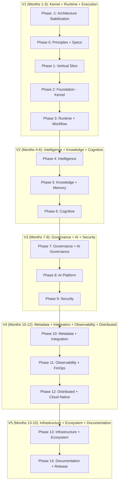

# BehaviorOS Roadmap — 15 Phases, 4 Levels, 12 Platforms

> **Last Updated:** July 2026
> **Status:** Architecture Stabilization — Phase -1 in progress
> **Version:** 2.0.0

---

## Legend

| Icon | Meaning |
|------|---------|
| 🚧 | In Progress |
| ⬜ | Not Started |
| ✅ | Complete |

---

## Architecture Levels

```
Level 1: Kernel     → Event Sourcing, CQRS, Contracts, Event Mesh, Lifecycle
Level 2: Cognitive  → Intelligence, Cognitive, Knowledge, AI
Level 3: Governance → Governance + Security
Level 4: Platform   → Metadata, Integration, Infrastructure, Ecosystem
```

---

## Version Releases

| Version | Months | Phases | Scope |
|---------|--------|--------|-------|
| **V1** | Months 1-3 | -1 through 3 | Kernel + Runtime + Execution |
| **V2** | Months 4-6 | 4-6 | Intelligence + Knowledge + Cognitive |
| **V3** | Months 7-9 | 7-9 | Governance + AI + Security |
| **V4** | Months 10-12 | 10-12 | Metadata + Integration + Observability + Distributed |
| **V5** | Months 13-15 | 13-14 | Infrastructure + Ecosystem + Documentation |

---

## Phase -1: Architecture Stabilization 🚧

**Goal:** Define immutable architecture rules before any new code is written.

| # | Milestone | Status |
|---|-----------|--------|
| -1.1 | ARCHITECTURE_PRINCIPLES.md — 15 governance principles | 🚧 |
| -1.2 | PACKAGE_ARCHITECTURE.md — 4-level/12-package structure | 🚧 |
| -1.3 | DEPENDENCY_MATRIX.md — DAG with forbidden circular rules | 🚧 |
| -1.4 | VERSIONING_POLICY.md — SemVer strategy | 🚧 |
| -1.5 | COMPATIBILITY_POLICY.md — Never break / Always rules | 🚧 |
| -1.6 | COMPONENT_LIFECYCLE.md — 6 stages: Draft → Archived | 🚧 |
| -1.7 | CONTRIBUTING.md — Contribution guide | 🚧 |
| -1.8 | RFC_PROCESS.md — RFC lifecycle | 🚧 |
| -1.9 | ARCHITECTURE_DECISION_PROCESS.md — ADR process | 🚧 |
| -1.10 | ADR-001 through ADR-008 — Core ADRs | 🚧 |
| -1.11 | ROADMAP.md — 15-phase roadmap (this file) | 🚧 |

**Gate:** All 18 architecture docs exist and are consistent.

---

## Phase 0: Principles + Specs + ADRs ⬜

**Goal:** Complete foundational specs, update ADRs, establish governance.

| # | Milestone | Status |
|---|-----------|--------|
| 0.1 | EVENT_MESH_SPEC.md — Complete Event Mesh specification | ⬜ |
| 0.2 | CAPABILITY_SPEC.md — Capability model specification | ⬜ |
| 0.3 | ADR-009 through ADR-020 — Extended ADRs | ⬜ |
| 0.4 | KERNEL_SPEC.md — Updated Kernel specification | ⬜ |
| 0.5 | PLATFORM_SPEC.md — Updated Platform specification | ⬜ |
| 0.6 | Quality gates automated in CI | ⬜ |

**Gate:** All specs complete → all ADRs accepted → CI quality gates operational.

---

## Phase 1: Vertical Slice ⬜

**Goal:** End-to-end validation — a complete workflow from Intent to Action.

| # | Milestone | Status |
|---|-----------|--------|
| 1.1 | Vertical Slice — Intent → Plan → Execute → Observe → Learn | ⬜ |
| 1.2 | Core event types defined | ⬜ |
| 1.3 | Contract interfaces defined | ⬜ |
| 1.4 | Integration tests for full slice | ⬜ |

**Gate:** Vertical slice passes → all contract interfaces stable.

---

## Phase 2: Foundation (Kernel) ⬜

**Goal:** Build the Kernel — Event Sourcing, CQRS, Contracts, Event Mesh, Capability Registry.

| # | Milestone | Status |
|---|-----------|--------|
| 2.1 | Event Store — Append-only event persistence | ⬜ |
| 2.2 | Event Bus + Command Bus + Query Bus + Notification Bus + Stream Bus | ⬜ |
| 2.3 | Contract definitions — All interfaces | ⬜ |
| 2.4 | Engine Registry — Engine lifecycle management | ⬜ |
| 2.5 | Capability Registry — Capability registration and discovery | ⬜ |
| 2.6 | Capability Graph — "Who can do what?" | ⬜ |
| 2.7 | Lifecycle Management — Component lifecycle engine | ⬜ |
| 2.8 | Storage Provider — Storage abstraction (filesystem, SQLite, Postgres, Redis, S3, Memory) | ⬜ |

**Gate:** All 8 milestones → event store tested → all 5 buses operational.

---

## Phase 3: Runtime + Workflow ⬜

**Goal:** Build the Runtime — Mission Compiler, Workflow Engine, Scheduler, Execution.

| # | Milestone | Status |
|---|-----------|--------|
| 3.1 | Mission Compiler — DSL to executable plan | ⬜ |
| 3.2 | Workflow Engine — State Machine, Transitions, Saga | ⬜ |
| 3.3 | Scheduler — Priority-based scheduling | ⬜ |
| 3.4 | Queue Manager — Persistent queue with backpressure | ⬜ |
| 3.5 | Worker Pool — Worker lifecycle management | ⬜ |
| 3.6 | Retry Manager — Exponential backoff | ⬜ |
| 3.7 | Resource Manager — CPU, RAM, GPU, Token, Time, Cost budgets | ⬜ |
| 3.8 | Parallel Executor — Parallel branch execution | ⬜ |
| 3.9 | LocalRuntime — Local execution environment | ⬜ |

**Gate:** All 9 milestones → Runtime compiles missions → Workflow executes end-to-end.

---

## Phase 4: Intelligence ⬜

**Goal:** Build the Intelligence platform — Intent, Goal, Planning, Strategy, Reasoning.

| # | Milestone | Status |
|---|-----------|--------|
| 4.1 | Intent Engine — Intent detection, classification, routing | ⬜ |
| 4.2 | Goal Engine — Goal decomposition, hierarchy, tracking | ⬜ |
| 4.3 | Planning Engine — Strategic → Operational → Execution → TaskGraph | ⬜ |
| 4.4 | Strategy Engine — Strategy selection, adaptation, fallback | ⬜ |
| 4.5 | Reasoning Engine — Deductive, inductive, abductive reasoning | ⬜ |
| 4.6 | Evaluation Engine — Pre/post execution evaluation | ⬜ |
| 4.7 | Learning Engine — Pattern detection, auto-apply | ⬜ |
| 4.8 | Capability Marketplace — Discovery, rating, selection | ⬜ |
| 4.9 | Semantic Registry — Embedding-based semantic search | ⬜ |
| 4.10 | Decision Engine — Multi-criteria voting | ⬜ |
| 4.11 | Conflict Resolver — Agent conflict resolution | ⬜ |
| 4.12 | Escalation Manager — Human-in-the-loop escalation | ⬜ |

**Gate:** All 12 milestones → Intent → Plan end-to-end → Decision engine operational.

---

## Phase 5: Knowledge + Memory Fabric ⬜

**Goal:** Build the Knowledge platform — Graph, Memory, Ontology, Vector Index.

| # | Milestone | Status |
|---|-----------|--------|
| 5.1 | Knowledge Graph — Entities, relations, properties | ⬜ |
| 5.2 | Knowledge Diff/Merge/Version/Branch/Review/Publish | ⬜ |
| 5.3 | Knowledge Cache — TTL, domain invalidation | ⬜ |
| 5.4 | Memory Short-term — Ephemeral, task-scoped | ⬜ |
| 5.5 | Memory Working — Active context, attention window | ⬜ |
| 5.6 | Memory Long-term — Persistent, indexed | ⬜ |
| 5.7 | Memory Semantic — Concepts, embeddings | ⬜ |
| 5.8 | Memory Procedural — Skills, workflows | ⬜ |
| 5.9 | Memory Episodic — Events, timeline | ⬜ |
| 5.10 | Ontology Manager — Ontology definition, evolution | ⬜ |
| 5.11 | Vector Index — Embedding storage, similarity search | ⬜ |
| 5.12 | Fact Extractor — Fact extraction, validation | ⬜ |
| 5.13 | Evidence Manager — Evidence collection, verification | ⬜ |

**Gate:** All 13 milestones → Knowledge Graph operational → All 6 memory types tested.

---

## Phase 6: Cognitive ⬜

**Goal:** Build the Cognitive platform — Observation, Understanding, Evidence, Truth.

| # | Milestone | Status |
|---|-----------|--------|
| 6.1 | Observation Engine — Event ingestion, pattern detection | ⬜ |
| 6.2 | Understanding Engine — Context building, intent extraction | ⬜ |
| 6.3 | Evidence Graph — Evidence relationships, verification | ⬜ |
| 6.4 | Truth Vector — Multi-dimensional truth calculation | ⬜ |
| 6.5 | Cognitive Index — Cognitive health score | ⬜ |
| 6.6 | Context Budget — Token budget management | ⬜ |
| 6.7 | Semantic Reasoning — Implicit relations, contradiction detection | ⬜ |

**Gate:** All 7 milestones → Evidence Graph operational → Truth Vector validated.

---

## Phase 7: Governance + Policy-as-Code + AI Governance ⬜

**Goal:** Build the Governance platform — Policy, Rule, Risk, Compliance, AI Governance.

| # | Milestone | Status |
|---|-----------|--------|
| 7.1 | Policy Engine — Declarative policy evaluation | ⬜ |
| 7.2 | Rule Engine — Rule execution, enforcement | ⬜ |
| 7.3 | Risk Engine — Risk assessment, scoring | ⬜ |
| 7.4 | Compliance Engine — Framework orchestration | ⬜ |
| 7.5 | Governance Gate — Final decision point | ⬜ |
| 7.6 | OPA Integration — OPA/Rego evaluation | ⬜ |
| 7.7-7.12 | Compliance Providers — SOC2, ISO27001, GDPR, LGPD, HIPAA, PCI | ⬜ |
| 7.13-7.24 | AI Governance — Bias Detector, Hallucination Detector, Explainability Engine, Safety Engine, Human Approval, Provenance Engine, Confidence Calibration, Prompt Lineage, Model Lineage, Dataset Lineage, Decision Explainability, Intervention Tracker | ⬜ |

**Gate:** All 24 milestones → Policy Engine operational → AI Governance validated.

---

## Phase 8: AI Platform ⬜

**Goal:** Build the AI platform — Model Registry, Router, AI Resource Manager, Prompt, Inference.

| # | Milestone | Status |
|---|-----------|--------|
| 8.1 | Model Registry — Model metadata, capabilities, costs | ⬜ |
| 8.2 | Model Router — Task → model matching, fallback | ⬜ |
| 8.3 | AI Resource Manager — GPU, CPU, context, token, cost, latency, cache, fallback | ⬜ |
| 8.4 | Prompt Registry — Prompt versioning, templates | ⬜ |
| 8.5 | Prompt Compiler — Template → executable prompt | ⬜ |
| 8.6 | Context Builder — Context assembly, window management | ⬜ |
| 8.7 | Inference Engine — LLM execution, streaming | ⬜ |
| 8.8 | Response Evaluator — Quality, relevance, safety scoring | ⬜ |

**Gate:** All 8 milestones → Model Registry populated → Inference Engine operational.

---

## Phase 9: Security ⬜

**Goal:** Build the Security platform — Identity, RBAC, ABAC, Vault, Zero Trust.

| # | Milestone | Status |
|---|-----------|--------|
| 9.1 | Identity Engine — Identity management, authentication | ⬜ |
| 9.2 | RBAC Engine — Role-based access control | ⬜ |
| 9.3 | ABAC Engine — Attribute-based access control | ⬜ |
| 9.4 | Secrets Engine — Secret management, rotation | ⬜ |
| 9.5 | Vault Engine — Encrypted storage, access logging | ⬜ |
| 9.6 | Encryption Engine — Encryption at rest/transit | ⬜ |
| 9.7 | Key Rotation — Automated key rotation | ⬜ |
| 9.8 | Zero Trust Engine — Zero trust verification | ⬜ |
| 9.9 | Certificate Manager — TLS/certificate management | ⬜ |

**Gate:** All 9 milestones → Zero Trust operational → Security audit passes.

---

## Phase 10: Metadata + Integration ⬜

**Goal:** Build Metadata Platform (DNS) and Integration Platform (Adapters, Connectors).

| # | Milestone | Status |
|---|-----------|--------|
| 10.1 | Schema Registry — Schema versioning, validation | ⬜ |
| 10.2 | Contract Registry — Contract discovery, compatibility | ⬜ |
| 10.3 | Capability Catalog — Capability inventory | ⬜ |
| 10.4 | Model Catalog — AI model metadata | ⬜ |
| 10.5 | Policy Catalog — Policy inventory | ⬜ |
| 10.6 | Tenant Registry — Tenant metadata | ⬜ |
| 10.7 | Plugin Catalog — Plugin metadata | ⬜ |
| 10.8 | Agent Catalog — Agent metadata | ⬜ |
| 10.9 | Ontology Registry — Ontology definitions | ⬜ |
| 10.10 | Adapter Framework — Kafka, RabbitMQ, NATS, Redis Streams | ⬜ |
| 10.11 | Connector Framework — REST, gRPC, GraphQL, MCP, A2A, ACP | ⬜ |
| 10.12 | Webhook Manager — Webhook registration, delivery | ⬜ |
| 10.13 | OAuth Manager — OAuth flows, token management | ⬜ |
| 10.14 | Queue Adapters — Queue technology abstraction | ⬜ |

**Gate:** All 14 milestones → Metadata Platform operational → 3+ adapters tested.

---

## Phase 11: Observability + FinOps ⬜

**Goal:** Build Observability and FinOps — Metrics, Tracing, Logging, Cost.

| # | Milestone | Status |
|---|-----------|--------|
| 11.1 | Metrics — Latency, throughput, error rate | ⬜ |
| 11.2 | Tracing — Distributed tracing across components | ⬜ |
| 11.3 | Logging — Structured, searchable, correlated | ⬜ |
| 11.4 | Profiling — CPU, memory, IO profiling | ⬜ |
| 11.5 | Health — Component health checks | ⬜ |
| 11.6 | Alert — Alert rules, notification channels | ⬜ |
| 11.7 | Telemetry — Usage telemetry, adoption metrics | ⬜ |
| 11.8 | AI Metrics — Model latency, cost, accuracy | ⬜ |
| 11.9 | Cost Metrics — Cost per task, mission, tenant | ⬜ |
| 11.10 | Audit Stream — Real-time audit event streaming | ⬜ |
| 11.11 | FinOps Engine — Cost optimization, budget management | ⬜ |

**Gate:** All 11 milestones → Grafana dashboard operational → Cost tracking live.

---

## Phase 12: Distributed + Cloud Native ⬜

**Goal:** Make the system distributed — Cluster, Leader Election, Kubernetes.

| # | Milestone | Status |
|---|-----------|--------|
| 12.1 | Kernel Cluster — Multi-node kernel | ⬜ |
| 12.2 | Leader Election — Raft-based leader election | ⬜ |
| 12.3 | Distributed Lock — Distributed mutex | ⬜ |
| 12.4 | Distributed Event Bus — Cross-node event distribution | ⬜ |
| 12.5 | Distributed Memory — Distributed memory fabric | ⬜ |
| 12.6 | Kubernetes Operator — K8s operator for BehaviorOS | ⬜ |
| 12.7 | Helm Charts — Helm deployment charts | ⬜ |
| 12.8 | CRDs — Custom Resource Definitions | ⬜ |
| 12.9 | Auto-scaling — Horizontal pod autoscaling | ⬜ |
| 12.10 | Service Discovery — Service discovery integration | ⬜ |

**Gate:** All 10 milestones → 3-node cluster operational → K8s deployment tested.

---

## Phase 13: Infrastructure + Ecosystem ⬜

**Goal:** Build Infrastructure platform — Plugin System, Digital Twin, Multi-tenant, Billing, SDK.

| # | Milestone | Status |
|---|-----------|--------|
| 13.1 | Plugin Lifecycle — Install, upgrade, remove | ⬜ |
| 13.2 | Marketplace — Plugin/skill marketplace | ⬜ |
| 13.3 | Permissions — Plugin permission model | ⬜ |
| 13.4 | Isolation — Plugin sandbox isolation | ⬜ |
| 13.5 | Digital Twin — State capture, replay, simulation, forecast, optimization | ⬜ |
| 13.6 | Chaos Engineering — Chaos injection, testing | ⬜ |
| 13.7 | Capacity Injection — Capacity testing | ⬜ |
| 13.8 | Multi-tenant — Tenant manager, workspace manager | ⬜ |
| 13.9 | Billing — Usage tracking, invoice generation | ⬜ |
| 13.10 | DSL — Kernel DSL parser, compiler | ⬜ |
| 13.11 | SDK Generator — Multi-language SDK (8 languages) | ⬜ |
| 13.12 | Domain Registry — Domain registration, boundaries | ⬜ |

**Gate:** All 12 milestones → Plugin marketplace operational → SDK generated for 3+ languages.

---

## Phase 14: Documentation + Release ⬜

**Goal:** Complete all documentation, release v1.0.0.

| # | Milestone | Status |
|---|-----------|--------|
| 14.1 | 18+ spec files complete | ⬜ |
| 14.2 | All ADRs documented | ⬜ |
| 14.3 | UML/Mermaid diagrams for all specs | ⬜ |
| 14.4 | JSON Schemas for all types | ⬜ |
| 14.5 | CLI P0 — Core CLI operational | ⬜ |
| 14.6 | Dashboard P0 — Core dashboard operational | ⬜ |
| 14.7 | Registry P1 — Registry features complete | ⬜ |
| 14.8 | Marketplace P1 — Marketplace features complete | ⬜ |
| 14.9 | v1.0.0 Release | ⬜ |

**Gate:** All 9 milestones → Documentation complete → v1.0.0 released.

---

## Dependency Graph



---

## Count of Total Milestones

| Phase | Milestones |
|-------|-----------|
| -1 | 11 |
| 0 | 6 |
| 1 | 4 |
| 2 | 8 |
| 3 | 9 |
| 4 | 12 |
| 5 | 13 |
| 6 | 7 |
| 7 | 24 |
| 8 | 8 |
| 9 | 9 |
| 10 | 14 |
| 11 | 11 |
| 12 | 10 |
| 13 | 12 |
| 14 | 9 |
| **Total** | **167** |

---

## References

- [ARCHITECTURE_PRINCIPLES.md](./ARCHITECTURE_PRINCIPLES.md) — 15 architectural principles
- [PACKAGE_ARCHITECTURE.md](./PACKAGE_ARCHITECTURE.md) — Package structure
- [DEPENDENCY_MATRIX.md](./DEPENDENCY_MATRIX.md) — Dependency rules
- [PROTOCOL.md](./PROTOCOL.md) — BehaviorOS Protocol

---

*BehaviorOS Roadmap v2.0.0 — July 2026*
